# IoLytics UML Diagrams
---

## Use Case Diagram

Shows all use cases in the IoLytics system.

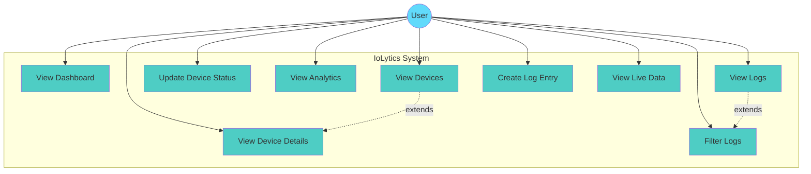

---

## Use Case 1: View Dashboard

### Sequence Diagram

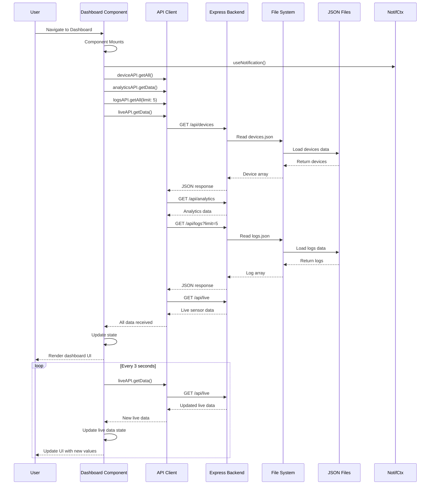

### Activity Diagram

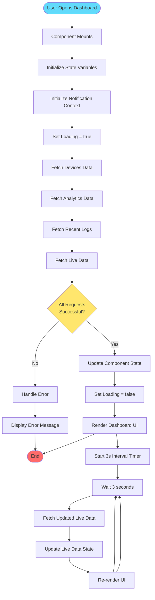

---

## Use Case 2: View Devices

### Sequence Diagram

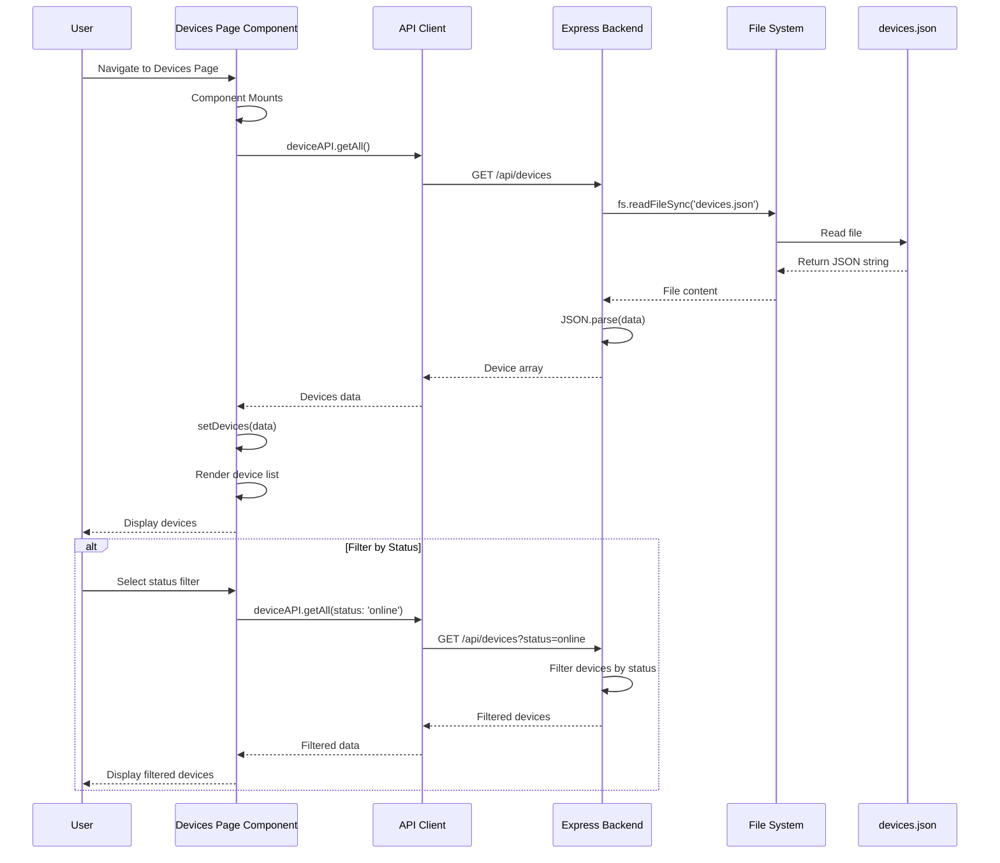

### Activity Diagram

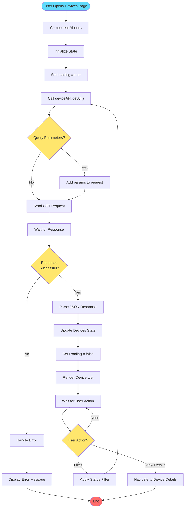

---

## Use Case 3: View Device Details

### Sequence Diagram

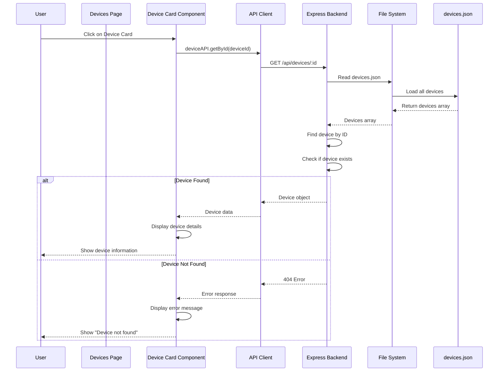

### Activity Diagram

```mermaid
flowchart TD
    Start([User Clicks Device])
    Start --> GetID[Get Device ID]
    GetID --> CallAPI[Call deviceAPI.getById(id)]
    CallAPI --> SendRequest[Send GET /api/devices/:id]
    SendRequest --> WaitResponse[Wait for Response]
    
    WaitResponse --> CheckResponse{Response<br/>Status?}
    CheckResponse -->|200 OK| ParseData[Parse Device Data]
    CheckResponse -->|404| ShowNotFound[Show 'Device Not Found']
    CheckResponse -->|500| ShowError[Show Error Message]
    
    ParseData --> DisplayDetails[Display Device Details]
    DisplayDetails --> ShowInfo[Show Device Information:<br/>- Name, Type, Location<br/>- Status, Last Active<br/>- Readings Data]
    ShowInfo --> End([End])
    
    ShowNotFound --> End
    ShowError --> End
    
    style Start fill:#61dafb
    style End fill:#ff6b6b
    style CheckResponse fill:#ffe66d
```

---

## Use Case 4: Update Device Status

### Sequence Diagram

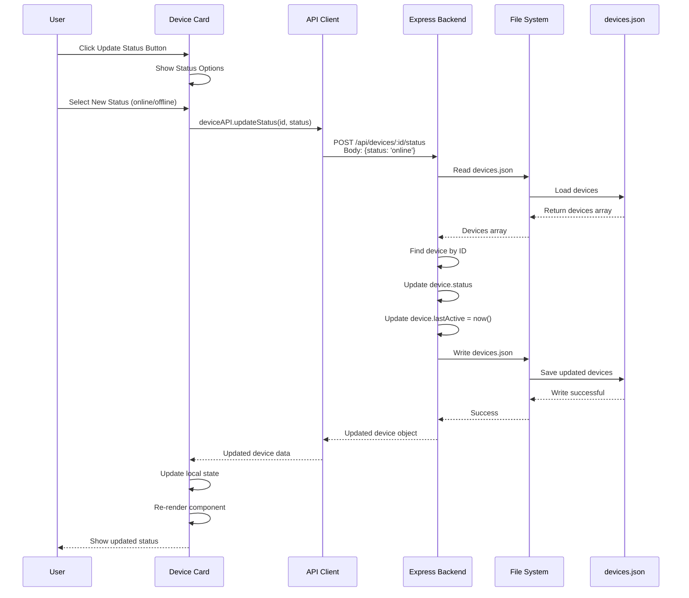

### Activity Diagram

```mermaid
flowchart TD
    Start([User Clicks Update Status])
    Start --> ShowOptions[Show Status Options]
    ShowOptions --> UserSelects{User Selects<br/>Status?}
    UserSelects -->|Cancel| End([Cancel])
    UserSelects -->|Select Status| GetStatus[Get Selected Status]
    
    GetStatus --> ValidateStatus{Status Valid?}
    ValidateStatus -->|No| ShowError[Show Validation Error]
    ValidateStatus -->|Yes| CallAPI[Call deviceAPI.updateStatus(id, status)]
    
    ShowError --> End
    
    CallAPI --> SendRequest[Send POST Request]
    SendRequest --> WaitResponse[Wait for Response]
    WaitResponse --> CheckResponse{Response<br/>Successful?}
    
    CheckResponse -->|404| ShowNotFound[Show 'Device Not Found']
    CheckResponse -->|500| ShowServerError[Show Server Error]
    CheckResponse -->|200| ParseResponse[Parse Updated Device]
    
    ShowNotFound --> End
    ShowServerError --> End
    
    ParseResponse --> UpdateFile[Backend: Update devices.json]
    UpdateFile --> UpdateState[Update Component State]
    UpdateState --> ReRender[Re-render Component]
    ReRender --> ShowSuccess[Show Success Message]
    ShowSuccess --> End
    
    style Start fill:#61dafb
    style End fill:#ff6b6b
    style UserSelects fill:#ffe66d
    style ValidateStatus fill:#ffe66d
    style CheckResponse fill:#ffe66d
```

---

## Use Case 5: View Analytics

### Sequence Diagram

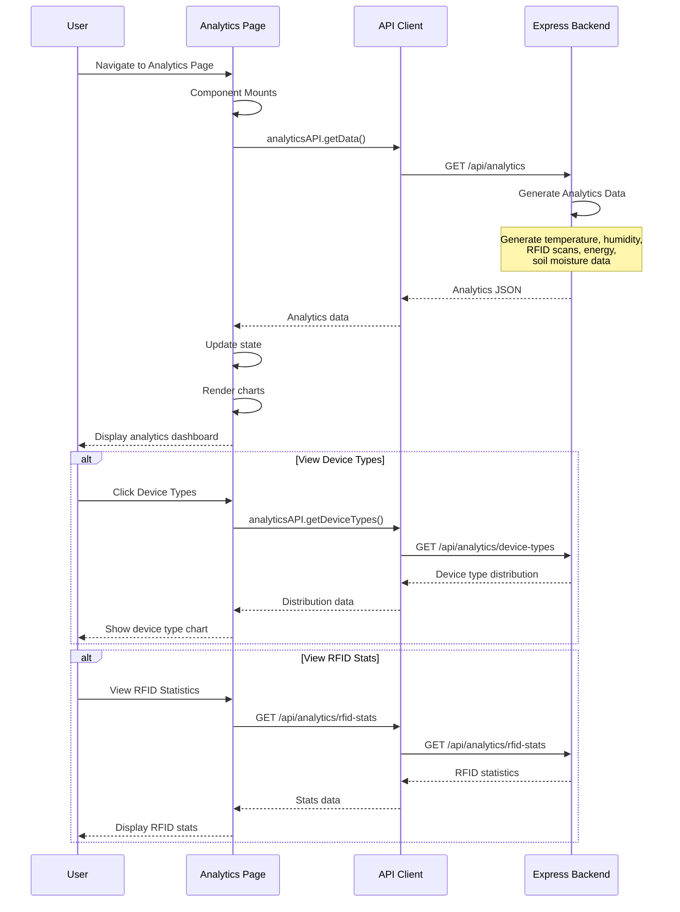

### Activity Diagram

```mermaid
flowchart TD
    Start([User Opens Analytics Page])
    Start --> Mount[Component Mounts]
    Mount --> InitState[Initialize State]
    InitState --> SetLoading[Set Loading = true]
    SetLoading --> FetchAnalytics[Call analyticsAPI.getData()]
    
    FetchAnalytics --> SendRequest[Send GET /api/analytics]
    SendRequest --> WaitResponse[Wait for Response]
    WaitResponse --> CheckResponse{Response<br/>Successful?}
    
    CheckResponse -->|No| HandleError[Handle Error]
    CheckResponse -->|Yes| ParseData[Parse Analytics Data]
    
    HandleError --> ShowError[Display Error]
    ShowError --> End([End])
    
    ParseData --> ExtractData[Extract Data:<br/>- Temperature trends<br/>- Humidity data<br/>- RFID scans<br/>- Energy consumption<br/>- Soil moisture]
    
    ExtractData --> UpdateState[Update Analytics State]
    UpdateState --> SetLoadingFalse[Set Loading = false]
    SetLoadingFalse --> RenderCharts[Render Charts with Recharts]
    
    RenderCharts --> DisplayCharts[Display:<br/>- Temperature Line Chart<br/>- RFID Bar Chart<br/>- Energy Line Chart<br/>- Humidity Chart]
    
    DisplayCharts --> WaitUserAction[Wait for User Action]
    
    WaitUserAction --> UserAction{User Action?}
    UserAction -->|View Device Types| FetchTypes[Fetch Device Types]
    UserAction -->|View RFID Stats| FetchRFID[Fetch RFID Stats]
    UserAction -->|View Energy Stats| FetchEnergy[Fetch Energy Stats]
    UserAction -->|None| WaitUserAction
    
    FetchTypes --> UpdateTypes[Update UI with Types]
    FetchRFID --> UpdateRFID[Update UI with RFID Stats]
    FetchEnergy --> UpdateEnergy[Update UI with Energy Stats]
    
    UpdateTypes --> WaitUserAction
    UpdateRFID --> WaitUserAction
    UpdateEnergy --> WaitUserAction
    
    style Start fill:#61dafb
    style End fill:#ff6b6b
    style CheckResponse fill:#ffe66d
    style UserAction fill:#ffe66d
```

---

## Use Case 6: View Logs

### Sequence Diagram

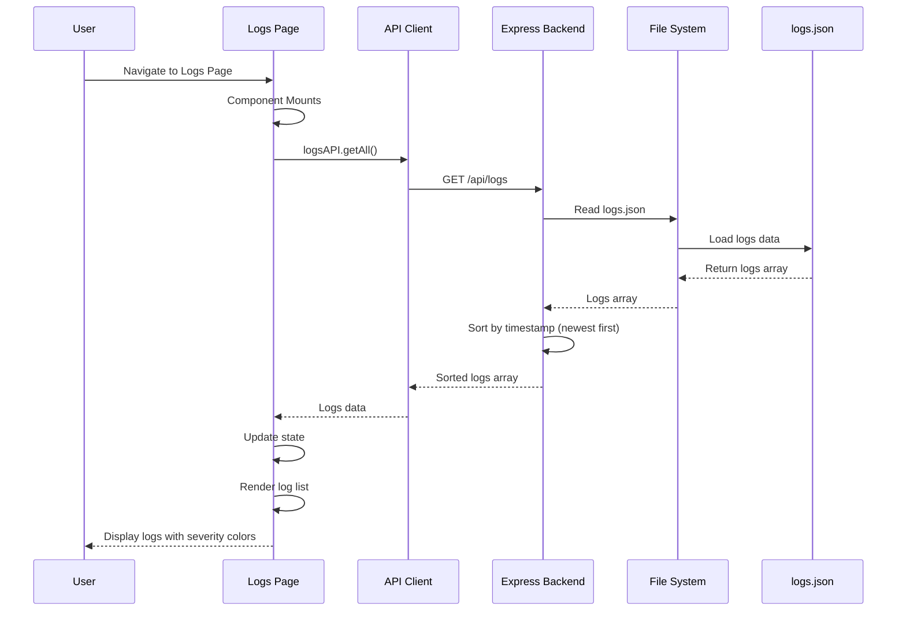

### Activity Diagram

```mermaid
flowchart TD
    Start([User Opens Logs Page])
    Start --> Mount[Component Mounts]
    Mount --> InitState[Initialize State]
    InitState --> SetLoading[Set Loading = true]
    SetLoading --> FetchLogs[Call logsAPI.getAll()]
    
    FetchLogs --> SendRequest[Send GET /api/logs]
    SendRequest --> WaitResponse[Wait for Response]
    WaitResponse --> CheckResponse{Response<br/>Successful?}
    
    CheckResponse -->|No| HandleError[Handle Error]
    CheckResponse -->|Yes| ParseData[Parse Logs Data]
    
    HandleError --> ShowError[Display Error]
    ShowError --> End([End])
    
    ParseData --> SortLogs[Backend: Sort by timestamp]
    SortLogs --> UpdateState[Update Logs State]
    UpdateState --> SetLoadingFalse[Set Loading = false]
    SetLoadingFalse --> RenderList[Render Log List]
    
    RenderList --> FormatLogs[Format Each Log:<br/>- Severity indicator<br/>- Timestamp<br/>- Device name<br/>- Message]
    
    FormatLogs --> DisplayLogs[Display Logs:<br/>- Info: Green<br/>- Warning: Yellow<br/>- Error: Red]
    
    DisplayLogs --> End
    
    style Start fill:#61dafb
    style End fill:#ff6b6b
    style CheckResponse fill:#ffe66d
```

---

## Use Case 7: Filter Logs

### Sequence Diagram

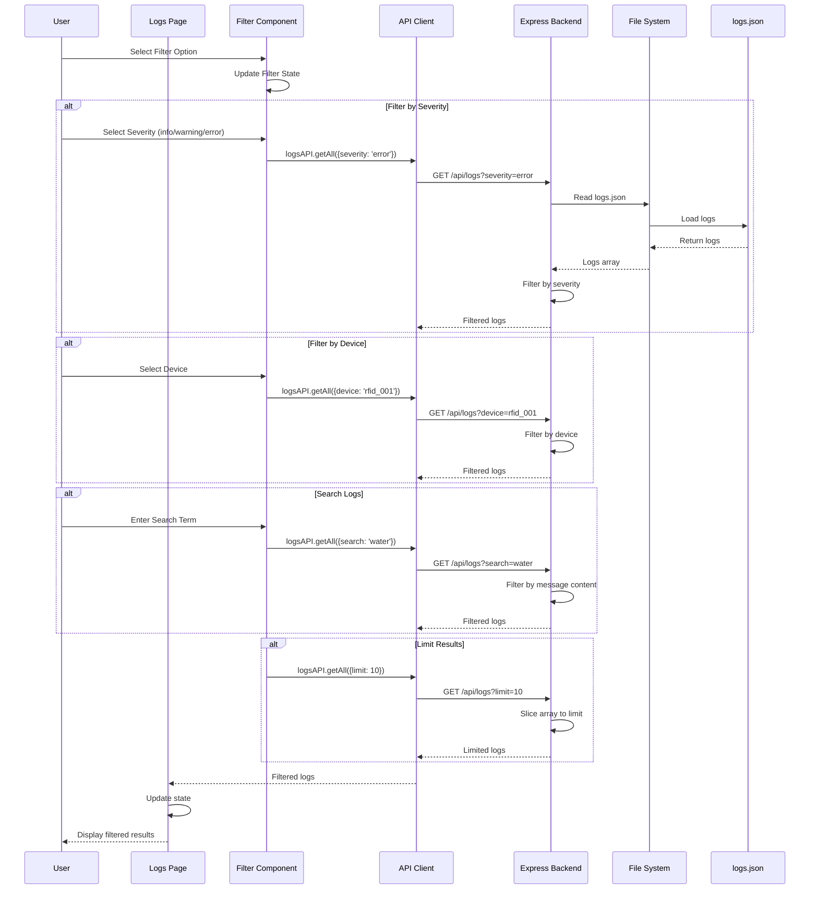

### Activity Diagram

```mermaid
flowchart TD
    Start([User Applies Filter])
    Start --> SelectFilter{Filter Type?}
    
    SelectFilter -->|Severity| GetSeverity[Get Severity Value]
    SelectFilter -->|Device| GetDevice[Get Device ID]
    SelectFilter -->|Search| GetSearch[Get Search Term]
    SelectFilter -->|Limit| GetLimit[Get Limit Number]
    
    GetSeverity --> BuildParams[Build Query Parameters]
    GetDevice --> BuildParams
    GetSearch --> BuildParams
    GetLimit --> BuildParams
    
    BuildParams --> CallAPI[Call logsAPI.getAll(params)]
    CallAPI --> SendRequest[Send GET /api/logs with params]
    SendRequest --> WaitResponse[Wait for Response]
    
    WaitResponse --> CheckResponse{Response<br/>Successful?}
    CheckResponse -->|No| HandleError[Handle Error]
    CheckResponse -->|Yes| ProcessFilters[Backend: Apply Filters]
    
    HandleError --> ShowError[Show Error]
    ShowError --> End([End])
    
    ProcessFilters --> FilterSeverity{Severity<br/>Filter?}
    FilterSeverity -->|Yes| ApplySeverity[Filter by severity]
    FilterSeverity -->|No| FilterDevice{Device<br/>Filter?}
    ApplySeverity --> FilterDevice
    
    FilterDevice -->|Yes| ApplyDevice[Filter by device]
    FilterDevice -->|No| FilterSearch{Search<br/>Filter?}
    ApplyDevice --> FilterSearch
    
    FilterSearch -->|Yes| ApplySearch[Filter by message content]
    FilterSearch -->|No| SortLogs[Sort by timestamp]
    ApplySearch --> SortLogs
    
    SortLogs --> CheckLimit{Limit<br/>Specified?}
    CheckLimit -->|Yes| ApplyLimit[Slice to limit]
    CheckLimit -->|No| ReturnResults[Return Results]
    ApplyLimit --> ReturnResults
    
    ReturnResults --> UpdateState[Update Logs State]
    UpdateState --> ReRender[Re-render Log List]
    ReRender --> ShowResults[Show Filtered Results]
    ShowResults --> End
    
    style Start fill:#61dafb
    style End fill:#ff6b6b
    style SelectFilter fill:#ffe66d
    style CheckResponse fill:#ffe66d
    style FilterSeverity fill:#ffe66d
    style FilterDevice fill:#ffe66d
    style FilterSearch fill:#ffe66d
    style CheckLimit fill:#ffe66d
```

---

## Use Case 8: Create Log Entry

### Sequence Diagram

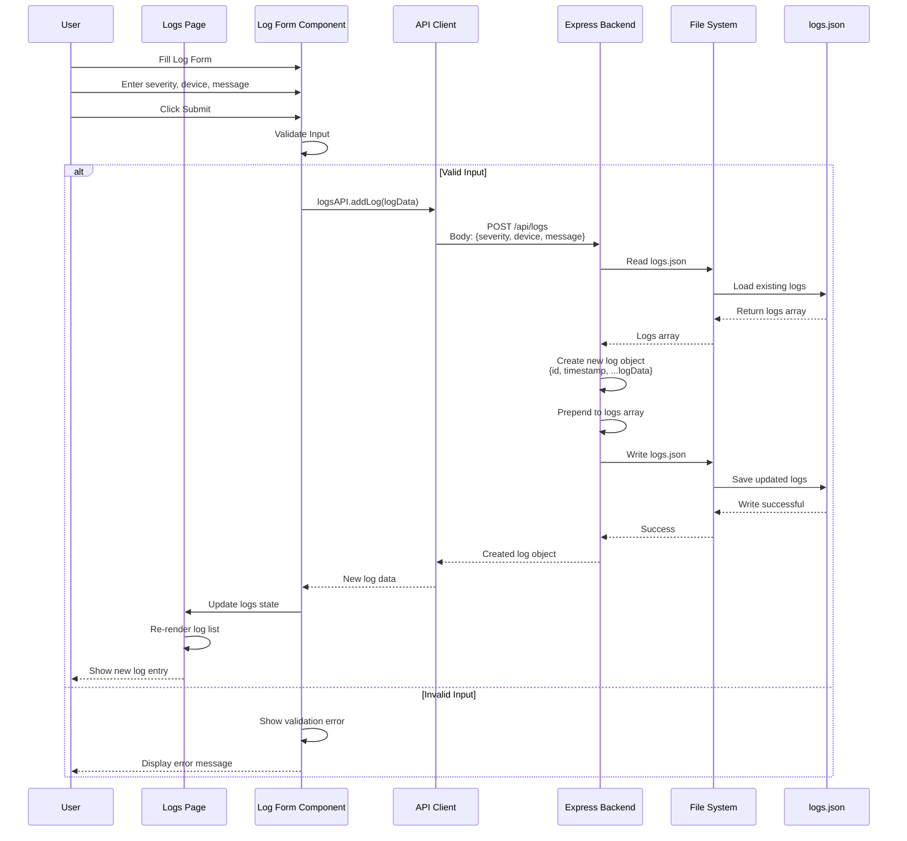

### Activity Diagram

```mermaid
flowchart TD
    Start([User Clicks Create Log])
    Start --> ShowForm[Show Log Form]
    ShowForm --> UserInput[User Enters Data:<br/>- Severity<br/>- Device<br/>- Message]
    
    UserInput --> ClickSubmit{User Clicks<br/>Submit?}
    ClickSubmit -->|Cancel| End([Cancel])
    ClickSubmit -->|Submit| ValidateInput[Validate Input]
    
    ValidateInput --> CheckSeverity{Severity<br/>Valid?}
    CheckSeverity -->|No| ShowSeverityError[Show Severity Error]
    CheckSeverity -->|Yes| CheckDevice{Device<br/>Valid?}
    
    ShowSeverityError --> End
    
    CheckDevice -->|No| ShowDeviceError[Show Device Error]
    CheckDevice -->|Yes| CheckMessage{Message<br/>Valid?}
    
    ShowDeviceError --> End
    
    CheckMessage -->|No| ShowMessageError[Show Message Error]
    CheckMessage -->|Yes| BuildLogData[Build Log Data Object]
    
    ShowMessageError --> End
    
    BuildLogData --> CallAPI[Call logsAPI.addLog(logData)]
    CallAPI --> SendRequest[Send POST /api/logs]
    SendRequest --> WaitResponse[Wait for Response]
    
    WaitResponse --> CheckResponse{Response<br/>Successful?}
    CheckResponse -->|500| ShowServerError[Show Server Error]
    CheckResponse -->|201| ProcessLog[Backend: Process Log]
    
    ShowServerError --> End
    
    ProcessLog --> ReadFile[Read logs.json]
    ReadFile --> CreateLog[Create Log Object:<br/>- id: log_timestamp<br/>- timestamp: now()<br/>- severity, device, message]
    
    CreateLog --> PrependLog[Prepend to logs array]
    PrependLog --> WriteFile[Write to logs.json]
    WriteFile --> ReturnLog[Return Created Log]
    
    ReturnLog --> UpdateState[Update Logs State]
    UpdateState --> ReRender[Re-render Log List]
    ReRender --> ShowSuccess[Show Success Message]
    ShowSuccess --> ClearForm[Clear Form]
    ClearForm --> End
    
    style Start fill:#61dafb
    style End fill:#ff6b6b
    style ClickSubmit fill:#ffe66d
    style CheckSeverity fill:#ffe66d
    style CheckDevice fill:#ffe66d
    style CheckMessage fill:#ffe66d
    style CheckResponse fill:#ffe66d
```

---

## Use Case 9: View Live Data

### Sequence Diagram

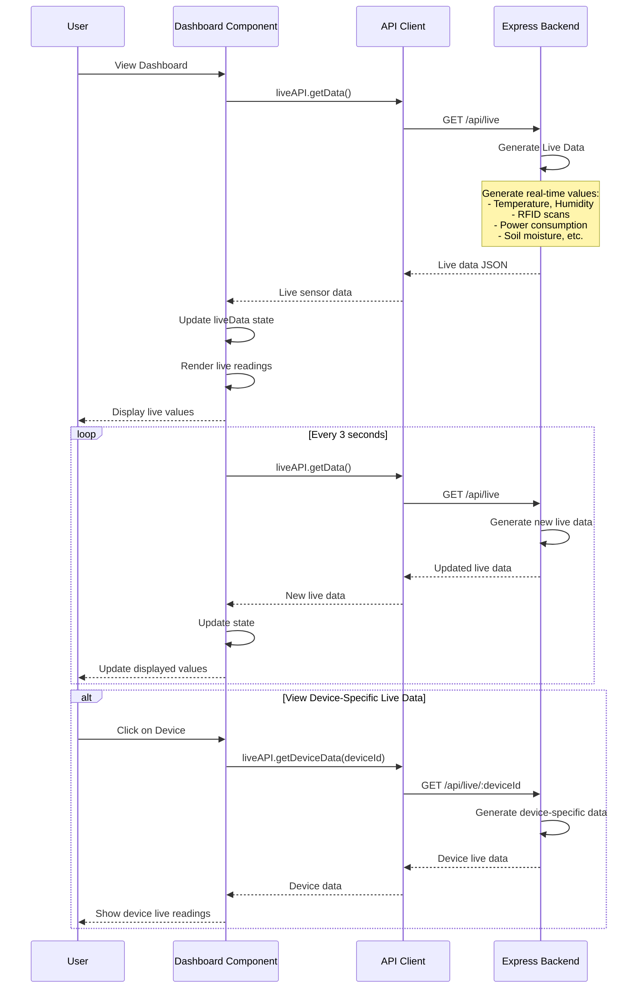

### Activity Diagram

```mermaid
flowchart TD
    Start([User Views Live Data])
    Start --> CallAPI[Call liveAPI.getData()]
    CallAPI --> SendRequest[Send GET /api/live]
    SendRequest --> WaitResponse[Wait for Response]
    
    WaitResponse --> CheckResponse{Response<br/>Successful?}
    CheckResponse -->|No| HandleError[Handle Error]
    CheckResponse -->|Yes| GenerateData[Backend: Generate Live Data]
    
    HandleError --> ShowError[Show Error]
    ShowError --> End([End])
    
    GenerateData --> CreateData[Create Live Data Object:<br/>- Temperature<br/>- Humidity<br/>- Pressure<br/>- Wind Speed<br/>- UV Index<br/>- RFID Scans<br/>- Power Consumption<br/>- Soil Moisture<br/>- etc.]
    
    CreateData --> AddTimestamp[Add updatedAt timestamp]
    AddTimestamp --> ReturnData[Return Live Data]
    
    ReturnData --> UpdateState[Update Live Data State]
    UpdateState --> RenderUI[Render Live Readings UI]
    RenderUI --> DisplayValues[Display Values in Grid]
    
    DisplayValues --> StartInterval[Start 3s Interval]
    StartInterval --> Wait3s[Wait 3 seconds]
    Wait3s --> RefreshData[Refresh Live Data]
    RefreshData --> GenerateData
    
    DisplayValues --> UserAction{User Action?}
    UserAction -->|View Device Data| GetDeviceData[Get Device-Specific Data]
    UserAction -->|None| StartInterval
    
    GetDeviceData --> CallDeviceAPI[Call liveAPI.getDeviceData(id)]
    CallDeviceAPI --> SendDeviceRequest[Send GET /api/live/:deviceId]
    SendDeviceRequest --> GenerateDeviceData[Generate Device Data]
    GenerateDeviceData --> DisplayDeviceData[Display Device Readings]
    DisplayDeviceData --> End
    
    style Start fill:#61dafb
    style End fill:#ff6b6b
    style CheckResponse fill:#ffe66d
    style UserAction fill:#ffe66d
```